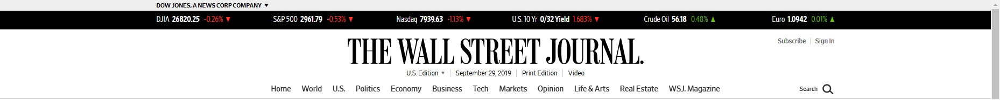
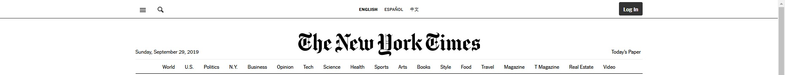

# MIS3690 Web Technologies - Homework 2

**Due: Saturday, 10/03/2019, by 11:59 PM**
---
**Note**: all *.html* files required below should be under  folder *WebTech*. All *.css* files should be under folder *WebTech/styles*.

## General Instructions:

- This is an individual assignment.
- 10 points will be deducted for each day or partial day late. 
- There are three questions in this homework. You need to create three `.html` files and necessary `.css` files. 
- At the bottom of each `.html` file, include the Honors Code statement using ***HTML comments***, “I, [your name], pledge my honor that I have neither received nor provided unauthorized assistance during the completion of this work".

## 1. Table (15 points)

Create the table shown below. You can find the picture of the products [here](images/airpods-pro.jpg) and [here](images/airpods.jpg). All styles must be done with external CSS **only**. 

- Table should be centered.
- All the text is centered, with `Arial` font.
- The heading “AirPods” is created using the `<caption>`. 
- Table border color is `lightgray`.
- The widths of columns are: `15%`, `30%`, `30%`, `10%` and `10%`.
- Use `<a>` to create "Buy" links. Each links to the real product page on apple.com or amazon.com. 
- The background of the links is `linear-gradient(#51a9ee,#147bcd);` (via Apple official website).
- Save it as `hw2-1.html` under `WebTech` folder. 

## 2. Form (15 points)

Create the form shown below. All styles must be done with internal CSS or external CSS only. **Inline CSS is not allowed.**

- Form should be centered.
- All the text uses `Arial` font.
- Use `<fieldset>` to group controls. Learn `<fieldset>` [here](https://developer.mozilla.org/en-US/docs/Web/HTML/Element/fieldset).
- `<fieldset>` border color is `lightgray`.
- Associate each `<label>` with corresponding `<input>`. 
- "*Sign me up for email updates*" should be pre-selected.
- Add any background color to page, and a different color to the form.
- Save it as `hw2-2.html` under `WebTech` folder. 

## 3. *"Cloning"* Real Website Header (20 points)

Replicate the header of **ONE** of the two websites: [wsj.com](https://www.wsj.com/) and [nytimes.com](https://www.nytimes.com/).

- This is an individual work.
- You need to write html and CSS code from scratch. 
- All links don't have to work. You can use `href=""` for all the `a` tags.
- You don't have to implement the dropdown menu. However, you need to implement the effect of a link when the user mouses over it needs - for example, the changing color and border of navigation bar link on [wsj.com](https://www.wsj.com/), or the (very light) shadow effect of navigation bar link on [nytimes.com](https://www.nytimes.com/). Hint: `:hover` [selector](https://developer.mozilla.org/en-US/docs/Web/CSS/:hover).
- You don't need to implement **search** functionality. You can create an invalid link instead.
- You can use either internal CSS or external CSS (recommended). **Inline CSS is not allowed.**
- This is a very challenging task. It is acceptable if you cannot replicate the original header 100%.
- Save it as `hw2-wsj.html` or `hw2-nytimes.html` under `WebTech` folder. 

## Submission:

1. Update *sitemap.html* under *WebTech* folder by adding links to the three *.html* files.
2. ***Commit and push*** to GitHub. 
3. Create a release.
   - Use tag version '`hw2`' for this release. You don't need to attach any files. 
   - Learn more about [*Managing releases in a repository*](https://help.github.com/en/github/administering-a-repository/managing-releases-in-a-repository).
